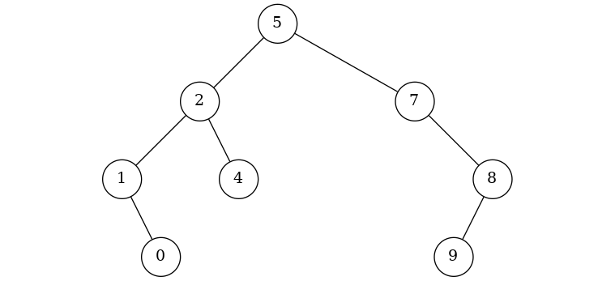

# Binary Tree and Linked List Visualizer

A tool to visualize binary trees and linked lists based on GraphViz.

## Requirements

- GraphViz

    Download: [http://www.graphviz.org/download/](http://www.graphviz.org/download/)

    **Note:** GraphViz must be added into `PATH` environment variable.

## Build

### Microsoft Visual Studio

1. Copy [binarytree.hpp](binary-tree-visualizer/binarytree.hpp), [linkedlist.hpp](binary-tree-visualizer/linkedlist.hpp), [binary-tree-visualizer.cpp](binary-tree-visualizer/binary-tree-visualizer.cpp) and [linked-list-visualizer.cpp](binary-tree-visualizer/linked-list-visualizer.cpp) to your project folder.
2. Add [binary-tree-visualizer.cpp](binary-tree-visualizer/binary-tree-visualizer.cpp) and [linked-list-visualizer.cpp](binary-tree-visualizer/linked-list-visualizer.cpp) to source files and add [binarytree.hpp](binary-tree-visualizer/binarytree.hpp) and [linkedlist.hpp](binary-tree-visualizer/linkedlist.hpp) to header files.
3. `#include "binarytree.hpp"` if you need to visualize binary trees, or `#include "linkedlist.hpp"` if you need to visualize linked lists.
4. Build and run your code.

### GNU GCC

1. Copy [binarytree.hpp](binary-tree-visualizer/binarytree.hpp), [linkedlist.hpp](binary-tree-visualizer/linkedlist.hpp), [binary-tree-visualizer.cpp](binary-tree-visualizer/binary-tree-visualizer.cpp) and [linked-list-visualizer.cpp](binary-tree-visualizer/linked-list-visualizer.cpp) to your project folder.
2. `#include "binarytree.hpp"` if you need to visualize binary trees, or `#include "linkedlist.hpp"` if you need to visualize linked lists.
3. Assumed that your source file is [demo.cpp](binary-tree-visualizer/demo.cpp), build your source code and the visualizer as the following command shows.
    ```bash
    g++ -O2 -std=c++11 binary-tree-visualizer.cpp linked-list-visualizer.cpp demo.cpp -o demo
    ```
4. Run your code
    ```bash
    ./demo
    ```
    The diagram will be generated in the folder of your project.

## Usage

### Binary Tree

- Definition of TreeNode

    ```c++
    // This is the same definition in Leetcode.
    struct TreeNode
    {
        int val;
        TreeNode *left;
        TreeNode *right;
        TreeNode(int x) : val(x), left(NULL), right(NULL) {}
    };
    ```

- Build a binary tree

    In order to build the following binary tree:
    ```
                5
               / \
              2   7
             / \   \
            1   4   8
    ```
    We may call function `makeTree` like this:
    ```c++
    TreeNode *root = makeTree({ 5,2,7,1,4,null,8 });
    ```
    **Note:** `null` represents an empty node. This is compatible with leetcode.

- Visualize the binary tree

    Call function `showTree` like this:
    ```c++
    showTree(root);
    ```
    The result is shown below:  
    

- Delete the binary tree

    ```c++
    delTree(root);
    root = nullptr;
    ```

### Linked List

- Definition of ListNode

    ```c++
    // This is the same definition in Leetcode.
    struct ListNode
    {
        int val;
        ListNode *next;
        ListNode(int x) : val(x), next(NULL) {}
    };
    ```

- Build a linked list

    In order to build the following linked list:
    ```
    5 -> 2 -> 0 -> 1 -> 3 -> 1 -> 4
    ```
    We may call function `makeList` like this:
    ```c++
    ListNode *head = makeList({ 5,2,0,1,3,1,4 });
    ```

- Visualize the linked list

    Call function `showList` like this:
    ```c++
    showList(head);
    ```
    The result is shown below:  
    

- Delete the linked list

    ```c++
    delList(head);
    head = nullptr;
    ```
